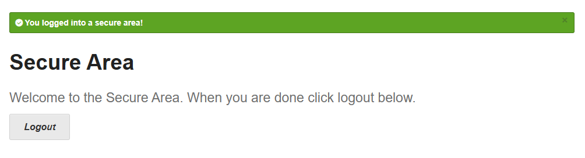

# CT-001 - Login com Credenciais Válidas

**Funcionalidade:** Autenticação  
**Pré-condição:** Página de login acessível (`/login`)

---

##  Passos:
1. Acessar `https://the-internet.herokuapp.com/login`
2. Inserir `tomsmith` no campo **Username**
3. Inserir `SuperSecretPassword!` no campo **Password**
4. Clicar em **Login**

---

##  Resultado Esperado:
- Usuário é redirecionado para `/secure`
- Exibe mensagem: "You logged into a secure area!"
- Botão **Logout** visível

---

##  Resultado Obtido:
- Sistema redirecionou corretamente para /secure.
- Mensagem exibida: "You logged into a secure area!"
- Botão Logout visível.
- ✅ Teste aprovado.

##  Evidências:
